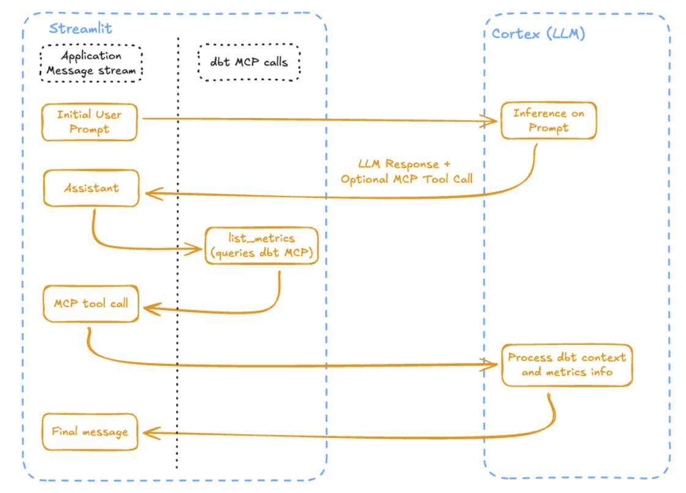
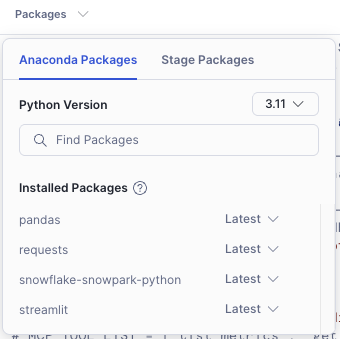
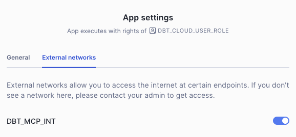

# dbt MCP + Snowflake Cortex Chat Analytics

This repository contains a Streamlit application that connects Snowflake Cortex to dbt's remote MCP (Model Context Protocol) server, enabling a powerful "chat-with-your-data" experience for analytics. Users can query their dbt Semantic Layer using natural language and receive intelligent, context-aware responses about their data.

## Who is this project for?

This project is designed for data teams who have:
- A commercial version of dbt Platform (required for MCP server access)
- Snowflake with Cortex enabled
- A dbt project with Semantic Layer models and metrics configured

This serves as an excellent example of building AI-driven analytics solutions that provide better context and results from your data warehouse through conversational interfaces.  We have used this content as part of a hands-on-workshop, but it could be a great starting point for building such an appliction (with a few tweaks).

## Architecture:

This project contains a Streamlit (SiS - Streamlit in Snowflake - see streamlit.py) app that leverages Cortex LLM functions (COMPLETE) along with dbt’s remote MCP server to provide a lightweight chat-based analytics interface.  The Streamlit app has stripped down MCP capabilities and only uses Semantic Layer tools: list_metrics, get_dimensions, get_entities, and query_metrics.  The LLM can orchestrate multiple tool calls to the MCP server and is fairly stable.



Example workflow for list_metrics (Ie. ‘What are my metrics?’) - workflow would be longer for additional toolcalls like query_metrics

## Setup Steps to Deploy to New Snowflake/dbt Account:

1. Set up dbt project w/ Semantic Layer Models.
    - See provided repo if needed, but this will work with any dbt SL configuration (it must contain metrics)
2. Set up Semantic Layer Config and add service token with warehouse credentials (don’t forget to copy info)
    - Service token should have Semantic Layer Only, Metadata Only, and Developer permissions
3. Snowflake setup:
    - setup warehouse, roles, db/schema/data
        
        For our example, we use a role, dbt_cloud_user_role for all students
        
    - Setup for Streamlit/MCP
        
        Please make the appropriate substitutions before running the following sql:

        ```sql
        use role accountadmin;
        
        -- if deploying to a region that does not have claude models available
        ALTER ACCOUNT SET CORTEX_ENABLED_CROSS_REGION = 'ANY_REGION';
        
        -- db/schema setup --
        create database if not exists streamlit;
        create schema if not exists public;

        -- NOTE: when creating your streamlit app, add to streamlit.public so it can access external access integration (see below)
        
        -- user / role setup --
        use role accountadmin;
        create role if not exists dbt_cloud_user_role;
        -- <ADD ANY PERMISSIONS YOU NEED FOR DBT DEVELOPMENT CREDENTIALS / ACCESS> --
        grant ownership on database streamlit to role dbt_cloud_user_role;
        grant ownership on schema streamlit.public to role dbt_cloud_user_role;
        
        -- grant role dbt_cloud_user_role to user "<insert your user here>";
        grant role dbt_cloud_user_role to role accountadmin;
        
        -- network rule + external access integration setup --
        use database streamlit;
        use schema public;
        
        use role dbt_cloud_user_role;
        
        create or replace network rule dbt_mcp_rule
        MODE = EGRESS
        TYPE = HOST_PORT
        -- you may need to update these depending on your dbt region
        VALUE_LIST = ('*.dbt.com', '*.getdbt.com', '*.eu2.dbt.com');
        
        show network rules;
        
        use role accountadmin;
        -- create or replace external access integration test_dbt_mcp_int
        create or replace external access integration dbt_mcp_int
        allowed_network_rules = (dbt_mcp_rule)
        enabled = true;
        
        show integrations;
        
        grant usage on integration dbt_mcp_int to role dbt_cloud_user_role;
        -- add any users who should access streamlit app to dbt_cloud_user_role
        ```
        
4. Streamlit setup:
    - Create New Streamlit app (under streamlit.public), edit & remove main contents
    - Add requests as a package
        
        
        
    - Enable external access integration by clicking on the options (… icon > upper right)
        
        
        
    - Environment.yml should look something like this
        
        ```sql
        name: app_environment
        channels:
          - snowflake
        dependencies:
          - python=3.11.*
          - snowflake-snowpark-python=
          - streamlit=
          - requests
          - pandas
        ```
        
    - Copy the main code into your new Streamlit app from either streamlit_v1_single_sl.py or streamlit_v2_multi_sl_with_cred_mgr.py:
        - streamlit_v1_single_sl.py - this is a simple configuration that you will hard code credentials for a single SL connection.  There are a few changes you will want to make before running:
            - `DEFAULT_MCP_URL` on line 11 - make sure to update this to reflect your specific dbt account
            - `TARGET_DATABASE` and `TARGET_SCHEMA` on lines 15-16 - this should point to your production deployment environment, and you must have run a job that includes semantic layer models + metrics
            - `DBT_TOKEN` and `DBT_PROD_ENV_ID` on lines 40-41
            - (optional) `model` on line 70
                - Currently (as of september 2025), one of the claude models must be used for tool calls but this may change in the future.
                - We saw good results with claude-3-5-sonnet, but you may also try claude-3-7-sonnet, claude-4-sonnet, and claude-4-opus.  These may have different cost & performance implications
                - See [(Snowflake Cortex AISQL (including LLM functions)](https://docs.snowflake.com/user-guide/snowflake-cortex/aisql?lang=it%252f) for model/region availability
        - streamlit_v2_multi_sl_with_cred_mgr.py - this is a more complex configuration that has a credentials management feature that allows the user to add/update/switch credentials between dbt SL connections.
            - You will want to update the default values on lines 12-16
            - Note: this app creates a table for storing and retrieving credentials.  This is currently set up as a demo without specific security on this table.  Please use caution and modify as necessary.
            - Once setup, users may add new Semantic Layer connections.  Opening an existing one allows users to update that connection using the 'Manage Connections' section in the sidebar.  Entries can be manually deleted from the 'MCP_CREDENTIALS' table.
            - Note: The app is currently setup so that users cannot modify the default connection

5. Analyze your data!
    - Start by asking what metrics you have available
    - You can ask for specific metrics by specific dimensions, or:
    - You can simply ask for insights to help you with a certain challenge
    - The LLM will offer analysis on the data that it gets back from the dbt semantic layer
    - You can also ask for a specific sql query used to generate a specific analysis

6. Tips:
    - If your LLM gets 'stuck', try refreshing the page.  This will refresh the LLM's 'memory', which in this case is a running list of all the prompts / responses / context from the dbt MCP server
    - There is an optional `DEBUG_MODE` at the top of streamlit.py.  This enables some debugging UI elements (mostly st.expander) that allows you to see individual payloads

7. Errors/Troubleshooting
    - 403 - prod_env_id could be incorrect.  You may not have added Developer permissions when creating SL token
    - 401 - unauthorized - check token (text) and service token setup in dbt
    - HTTPSConnectionPool(host='xxxxxx.dbt.com', port=443): Max retries exceeded with url - snowflake cannot reach the mcp endpoint - check url and network rule/external access integration
       